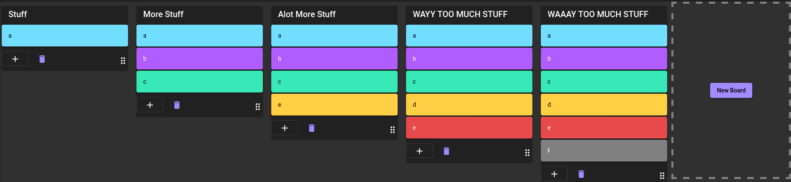

# Storello

Storello is a productivity board similar to trello.

This project is my attempt of implementing the drag and drop functionality using an enterprise framework @angular and a backend-as-a-service(baas) solution fireBase. 

## Image

# Demo
Check out this server-side-rendered version
[here](https://storello-nest-angular-ssr-aofpiwoi2a-nw.a.run.app)

Check out the pre-rendered version here 
[here](https://storello-5f13e.web.app/)
